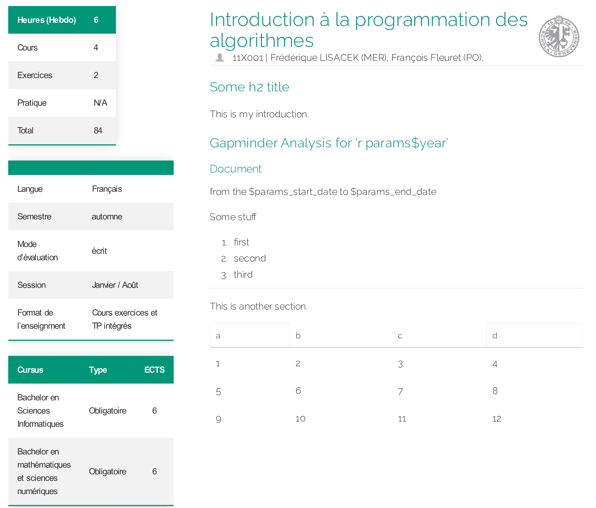

  
# Unige - 12X015 | Course Description Automator

Application to automatically generate printable 1-2 page PDF of course descriptions.

Made with:  

and a (little) bit of 

</a>

---

Exemple given:

 

|                                      Client                                      |                 Student / Developer                 |                                     Supervisor                                    |
|:--------------------------------------------------------------------------------:|:---------------------------------------------------:|:---------------------------------------------------------------------------------:|
| [Anne-Isabelle Giuntini](https://www.unige.ch/dinfo/contacts/contacts-francais/) | [Noah Munz](https://www.linkedin.com/in/noah-munz/) | [Dr. Guillaume Chanel](https://www.unige.ch/cisa/center/members/chanel-guillaume) |

 

## Meeting Reports

Meeting reports are available __[here](https://github.com/David-Kyrat/Course-Description-Automation/tree/master/PV)__.
They are numbered and dated and contains a quick summary
of what was discussed during the meeting as well as a list of all the participants. 

### Documentation

The file __[howto.md](https://github.com/David-Kyrat/Course-Description-Automation/blob/master/howto.md)__
contains a (very) quick summary of  which/how technology has been used as well as some brief commands.

Its goal is not to be documentation on how to use the project but rather
to categorize the "major steps" this project went through and to give some informations on how to reproduce some of these steps.

"Published" documentation is available here: __[Scala-Documentation](https://raw.githack.com/David-Kyrat/Course-Description-Automation-Docs/master/ch/index.html)__
  

