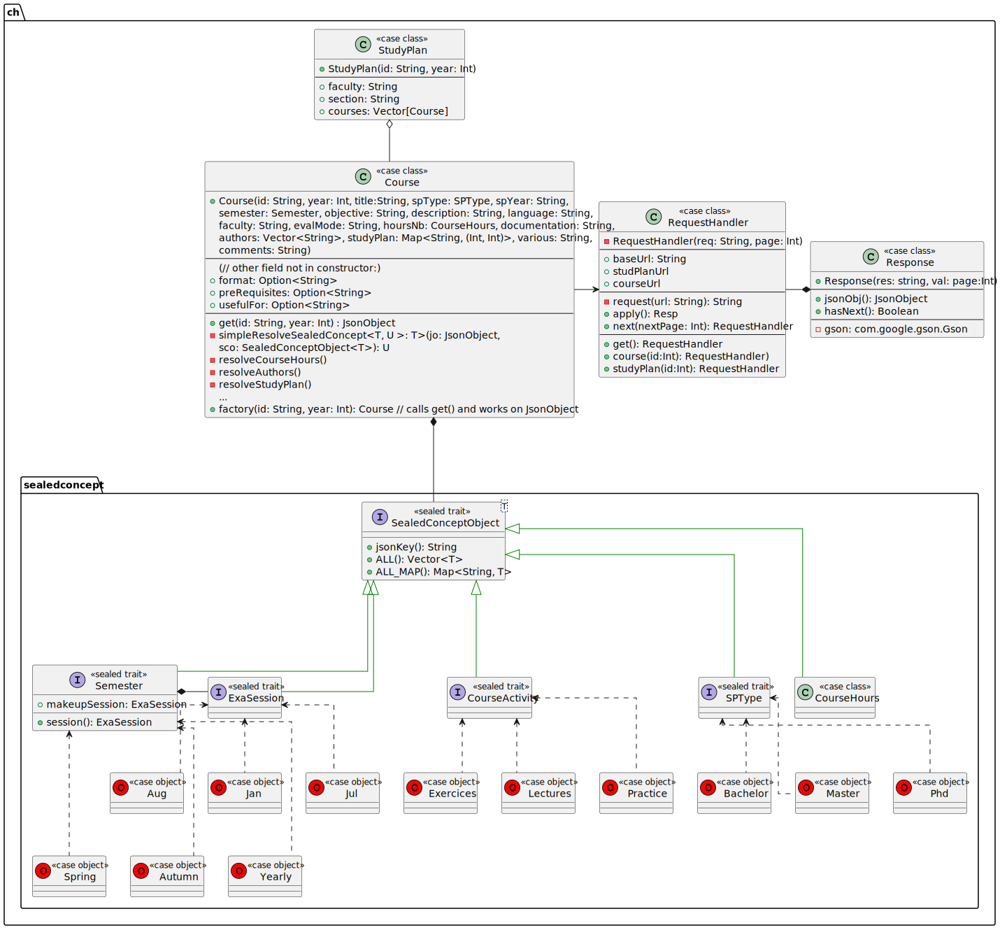
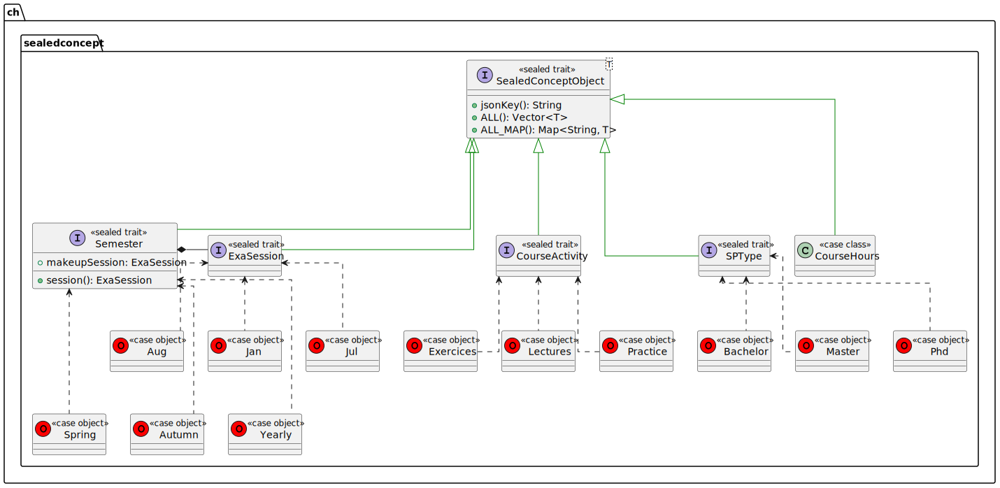
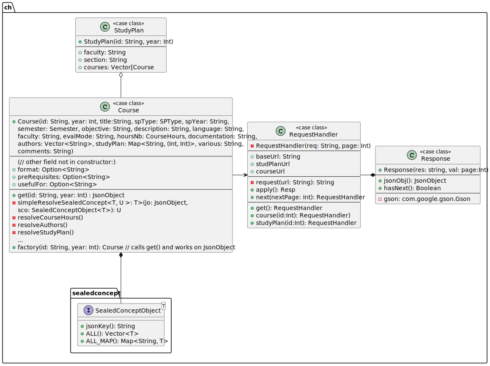

# Rapport Intermédiaire - Application Informatique (12X015)

#### *Noah Munz - 18 Avril 2023*

<br/>

# Table des matières

<!-- novim-markdown-toc GFM -->

* [Identification des besoins](#identification-des-besoins)
    * [Informations générales](#informations-générales)
        * [Qui est la cliente ?](#qui-est-la-cliente-)
        * [Qui seront les utilisateurs du logiciel ?](#qui-seront-les-utilisateurs-du-logiciel-)
        * [Quels sont les problèmes rencontrés ?](#quels-sont-les-problèmes-rencontrés-)
        * [Quel est l’objectif principal du logiciel, en quoi ce logiciel résoudra les problèmes ?](#quel-est-lobjectif-principal-du-logiciel-en-quoi-ce-logiciel-résoudra-les-problèmes-)
        * [Quelles sont les solutions existantes et en quoi la solution que vous proposez est différente ?](#quelles-sont-les-solutions-existantes-et-en-quoi-la-solution-que-vous-proposez-est-différente-)
        * [sous quelle licence le code sera-t-il livré ?](#sous-quelle-licence-le-code-sera-t-il-livré-)
    * [Liste des besoins](#liste-des-besoins)
        * [explicités par la cliente](#explicités-par-la-cliente)
        * [mis en avant par le developpeur](#mis-en-avant-par-le-developpeur)
* [Développement](#développement)
    * [Conception](#conception)
        * [Scénario d'utilisation](#scénario-dutilisation)
        * [Méthodes de conception et diagrammes](#méthodes-de-conception-et-diagrammes)
            * [Vue globale du projet](#vue-globale-du-projet)
    * [Implémentation](#implémentation)
    * [Tests et évaluation](#tests-et-évaluation)
* [Organisation](#organisation)
* [Formation](#formation)
* [Feedback](#feedback)
* [Annexes](#annexes)

<!-- vim-markdown-toc -->

***

<br/>

## Identification des besoins

### Informations générales

#### Qui est la cliente ?

Anne-Isabelle Giuntini, administration et secrétariat des étudiants de Battelle (Batiment A).

#### Qui seront les utilisateurs du logiciel ?

Principalement la cliente elle même.

#### Quels sont les problèmes rencontrés ?

<!-- TODO: -->

#### Quel est l’objectif principal du logiciel, en quoi ce logiciel résoudra les problèmes ?

es problèmes de la cliente ont commencé du au fait que le principal support utilisé
par l'université pour décrire un cours et son contenu était :

1.  Confus et épars (problème d'UI/UX dans l'affichage des informations)
2.  Présents à plusieurs endroits du site de l'université sans avoir de cohérence
    ni de *contenu* (i.e. données concrètes) ni de *forme* (i.e. séléction et mise en forme)
3.  Les informations n'étaient pas affichées dans leur integralité
4.  La modification de ces données était longue et fastidieuse à entreprendre à entreprendre

Sa solution (temporaire) était donc de reporter manuellement ces informations dans documents
word dont les pdfs étaient accessibles par les étudiants.

La création de ces pdfs est donc evidemment fastidieuse, répétitive et sujette à erreur.

C'est la qu'entre en jeux la solution developpé: l'automatisation de ces fiches descriptives.\
(Voir exemple ci-dessous)


L'object du logiciel est de générer automatiquement des PDFs de fiches descriptives de cours
de 1-2 pages qui contiennent cette compression et ce résumé

#### Quelles sont les solutions existantes et en quoi la solution que vous proposez est différente ?

Il n'existe pas de solution à proprement parler pour ce problème spécifique.
Pas automatisé tout du moins.
Ce qui est la principale différence de la solution apporté (en outre de
l'esthétisme du nouveau format)

#### sous quelle licence le code sera-t-il livré ?

Sous la license MIT.
Pour plus d'information voir [https://choosealicense.com/licenses/mit](https://choosealicense.com/licenses/mit/)

<br/>

### Liste des besoins

#### explicités par la cliente

*   PDF contenant un descriptif de cours
*   Information condensé dans un format pratique et concis (1 page A4)
*   Généré automatiquement

#### mis en avant par le developpeur

*   Génération de descriptifs "à la vollée" ("batch generation")
    par plan d'étude (rentrer un nom du type "BA-Inf" pour générer les descriptifs des cours du bachelor en sciences informatiques)

*   Realisation d'un installeur windows (.msi) pour simplifier le déploiement et éviter
    l'execution de scripts powershell qui sont, certes très pratiques, mais désactivés / bloqués
    par défaut sur la plupart des machines.

*   Implémentation d'une interface en rust qui utilise directement l'api Windows
    (voir [winsafe](https://docs.rs/winsafe/latest/winsafe/) et [winapi](https://docs.rs/winapi/latest/winapi/))
    pour lancer de manière "safe" les différents programmes externes ([pandoc](https://pandoc.org/) et [wkhtmltopdf](https://wkhtmltopdf.org/)) en parallèle afin de

    1.  Encore eviter l'utilisation de scripts powershell dont l'execution pourrait se faire bloquer sur la machine de la cliente.
    2.  Permettre un traitement "en masse" de fichiers markdown, effficient et optimisé grâce à la
        librairie de traitement de donnése en parallèle de rust, [rayon](https://docs.rs/rayon/latest/rayon/).

***

<br/>

## Développement

### Conception

#### Scénario d'utilisation

Pour donner un exemple d'utilisation sous forme de scénario, prenons en considération
le changement de batiment du cours de base de données qui a eu lieu il y a un ou deux ans.

Le cours de base de donnée était originellement, il y a un ou deux ans, donné à Uni-Bastions (>30min de trajet en tram du batiment informatique).
Cependant, au moment de l'écriture de ce rapport, il est toujours marqué dans la base de donnée de l'université que se cours se déroule à Bastion.

Ce qui pose le problème évident d'avoir l'intégralité des 2èmes des années du département d'informatique, se déplacer à l'opposé de la où ils ont réellement cours pour aller dans une salle qui est surement attribué à un autre cours/enseignant.

Ce problème n'aurait pas eu lieu si les descriptifs du cours présent à différents
endroits du site de l'université avaient pu régulièrment se mettre à jour.

#### Méthodes de conception et diagrammes

##### Vue globale du projet

La structure du projet est consitué de 3 parties:

1.  Une partie en Scala qui permet de parser le contenu de la base de donnée de l'université et de les convertir en fichier markdown.
    Elle permet également grâce à [sbt](https://www.scala-sbt.org/) (le build tool de scala) et [Wix](https://wixtoolset.org/docs/intro/)
    de générer un fichier .msi  (installeur windows)

2.  Une partie en Rust qui effectue des appels systèmes en parallèle à l'API de Windows pour convertir ces fichiers markdown en fichiers html puis pdf (en utilisant pandoc et wkhtmltopdf)

3.  Une partie en [Javafx](https://openjfx.io/) (libraire graphique de Java)  qui s'occupe de l'interface utilisateur (i.e. la gui)

design pattern (patrons de conception) de bases en Java/Scala  et pour la partie rust j'ai eu lourdement besoin du cours d'OS du semestre passé et de toutes les bonnes pratiques que j'ai pu en tirer.
En effet, j'ai assez sous-estimé les compétences techniques nécessaires pour comprendre Rust, le borrow-checker, la notion d'ownership d'une zone de mémoire virtuelle etc...

Pour la partie en scala, les designs patterns de base en Java/Scala ont été utilisé, ce qui à donnée suite au diagramme de classe suivant:



<!--  -->


Dû à sa taille il a été séparé en packages. Il y a en 2 pour la partie scala: `ch` le package principal et `sealedconcepts` qui représente les différents concepts qui forment un cours.
On a un `sealed trait` principal (`SealedConceptObject`), générique, duquel tous les autres découle.

Chaque concept spécifique est représente par un autre trait scélé qui implémente `SealedConceptObject`
mais pour le type spécifique qui représente ce concept. (e.g. la signature du trait `ExaSession` est :

```scala
sealed trait ExaSession
object ExaSession extends SealedConceptObject[ExaSession] { ... }
```

(En scala un `object` qui a le même nom qu'une classe, trait/interface, est appelé son `CompanionObject` 
on peut considérer que c'est une sorte de classe statique qui est assimilé à cette classe/trait, c'est pour ça qu'on ne voit que le trait sur le diagramme). 


Comme dit précédemment, le diagramme a été séparé en 2 packages, `ch.sealedconcepts` et `ch` respectivement:








<br>

stuff

stuff

***

<br/>

### Implémentation

*

### Tests et évaluation

*

***

<br/>

## Organisation

*

***

<br/>

## Formation

*

***

<br/>

## Feedback

*

## Annexes

*
