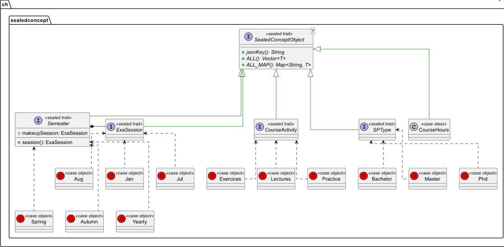
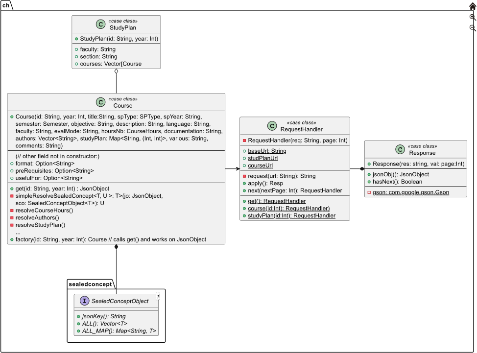

# Rapport Intermédiaire - Application Informatique (12X015)

#### *Noah Munz - 18 Avril 2023*

<br/>

<!-- # Table des matières -->

<!-- vim-markdown-toc GFM -->

* [Identification des besoins](#identification-des-besoins)
    * [Informations générales](#informations-générales)
        * [Qui est la cliente ?](#qui-est-la-cliente-)
        * [Qui seront les utilisateurs du logiciel ?](#qui-seront-les-utilisateurs-du-logiciel-)
        * [Quels sont les problèmes rencontrés ?](#quels-sont-les-problèmes-rencontrés-)
        * [Quel est l’objectif principal du logiciel, en quoi ce logiciel résoudra les problèmes ?](#quel-est-lobjectif-principal-du-logiciel-en-quoi-ce-logiciel-résoudra-les-problèmes-)
        * [Quelles sont les solutions existantes et en quoi la solution que vous proposez est différente ?](#quelles-sont-les-solutions-existantes-et-en-quoi-la-solution-que-vous-proposez-est-différente-)
        * [sous quelle licence le code sera-t-il livré ?](#sous-quelle-licence-le-code-sera-t-il-livré-)
    * [Liste des besoins](#liste-des-besoins)
        * [explicités par la cliente](#explicités-par-la-cliente)
        * [mis en avant par le developpeur](#mis-en-avant-par-le-developpeur)
* [Developpement](#developpement)
    * [Conception](#conception)
        * [Scenario d'utilisation](#scenario-dutilisation)
        * [Methodes de conception et diagrammes](#methodes-de-conception-et-diagrammes)
            * [Vue globale du projet](#vue-globale-du-projet)
            * [Diagrammes de classe](#diagrammes-de-classe)
    * [Implémentation](#implémentation)
        * [Choix et outils à disposition pour la réalistion du projet](#choix-et-outils-à-disposition-pour-la-réalistion-du-projet)
        * [Quels outils informatiques avez-vous utilisés (IDE, langages, git, programme externes, etc.) ? Pourquoi votre choix c’est porté sur ces outils ?](#quels-outils-informatiques-avez-vous-utilisés-ide-langages-git-programme-externes-etc--pourquoi-votre-choix-cest-porté-sur-ces-outils-)
    * [Tests et évaluation](#tests-et-évaluation)
* [Organisation](#organisation)
* [Formation](#formation)
* [Feedback](#feedback)

<!-- vim-markdown-toc -->

***

<br/>

## Identification des besoins

### Informations générales

#### Qui est la cliente ?

Anne-Isabelle Giuntini, administration et secrétariat des étudiants de Battelle (Batiment A).

#### Qui seront les utilisateurs du logiciel ?

Principalement la cliente elle même.

#### Quels sont les problèmes rencontrés ?

Les problèmes rencontrés ont été les suivants:

1.  Redondance et incomplétudedes données de la base de donnée de l'université
2.  Packager le projet et sortir une version "standalone"
3. L'apprentissage de la création d'installeurs windows (`.msi`) avec  [Wix](https://wixtoolset.org/) et le packager du build tool de scala [sbt-native-packager](https://www.scala-sbt.org/sbt-native-packager/index.html).
4. L'apprentissage de Rust

<br />

Plus précisment:

1. **Redondance BD**

Chaque réponse de requête à la BD de l'université, est **significativement** longue. Il y a **beaucoup** de duplication de donnée.  
Naviguer dans des fichiers de JSON de parfois presque un millier de ligne dont l'entropie approche dangereusement zero, n'a pas toujours été simple.  

Pour donner un exemple concret, chaque plan d'étude (e.g. bachelor en informatique) à 3 noms et
3 identifiants parfois identique parfois pas, parfois il y a juste le mot "sciences" rajouté ou enlevé 
quelque part.  
Et parmis ces 3, aucun n'est celui utilisé sur l'interface web décrivant les différents bachelor à laquelle on a tous accès.  
Cela veut dire, qu'il existe quelque part, un autre "stock" de donnée avec encore plus de duplication.  
Voir le [plan des attributs utilsés](https://github.com/David-Kyrat/Course-Description-Automation/blob/master/howto.md#which-field-from-the-database-is-relevant-)
dans ``howto.md`` pour plus d'informations.


2.  **Packaging**

Par défaut sur Windows, l'execution de la quasi totalité des scripts PowerShell est désactivé par défaut.  
Le paramètre gérant à quel moment un script PowerShell est autorisé à s'executer (i.e. les permissions d'executions "user") s'appelle `ExecutionPolicy`.

Par défaut ce paramètre vaut `Restricted` i.e.

> - The default execution policy for Windows client computers.  
> - Permits individual commands, but does not allow scripts.
> - Prevents running of all script files, including formatting and configuration files (.ps1xml), module script files (.psm1), and PowerShell profiles (.ps1).
>
> -- _https://learn.microsoft.com/en-us/powershell/module/microsoft.powershell.core/about/about_execution_policies?view=powershell-7.3_

Le maximum que l'on puisse faire est d'activer le "mode développeur" qui lui va passer de `Restricted` à `RemoteSigned` (i.e. approximativement tout autant reistreignant et incapacitant). Car
1. l'activation de ce mode, qui nécessite les droits administrateur, provoque plusieurs warning indiquant que le procédé n'est pas safe
2. Tous scripts "étrangers" (e.g. les miens) doivent être digitallement signé par une entité reconnu par microsoft.

<br >

Pour remédier à ces problèmes il a été décidé d'utiliser **Rust** pour générer, de manière safe et efficiente, pour créer:  
 1. Une application gérant tous les appeles à des dépendances externes, i.e. pandoc et wkhtmltopdf (plus d'informations sur ces outils dans la partie implémentation) ainsi que de gérer les dossiers de resources dans lesquels générer les differents outputs générés par le projet (markdown, html, pdf).


2. Un launcher qui s'occupe de localiser la version de java "bundled" et lancer la GUI javafx, puis récuperer son input et le donner au programme "principal" (scala) puis d'appeler l'application du point 1. pour terminer la conversion du markdown en pdf.

 En utilisant directement l'api windows (Win32), ou plutôt 


Pour plus d'information voir la partie [Packaging]() du `howto.md` à la râcine du répo.

Devoir faire marcher le projet, avec de toutes ses dépendances, de manière standalone sur un ordinateur "vierge" (celui de la cliente) i.e. sans JDK, sans la possibilité de lancer des scripts powershell (à moins de le faire signer)...  


De ce problème, découle 2 sous-problèmes:

3. L'apprentissage de la création d'installeurs windows (`.msi`)
    - Processus long et fastidieux
    - consitué principalement de configuration de fichiers xml avec une syntaxe spécifique à microsoft [Course-Description-Automation.wxs](https://github.com/David-Kyrat/Course-Description-Automation/blob/build/target/windows/Course-Description-Automation.wx 
    - La documentation sur ce sujet est abondante mais soit elle documente la création d'un installateur bien trop complexe pour le projets avec des GUI propriétaires de microsoft assez obscure (en plus de Wix). Soit elle documente la création de l'installeur le plus minimaliste possible.  
    Assez étonnament il n'est jamais clair dans laquel des 2 situation l'on ce situe en lisant cette dernière.

Puis

4. L'apprentissage de Rust
   - Processus  bien plus enrichissant et honnêtement passionnant, 
   - Grandement sous-estimé, bien trop complexe pour être appris "sur le tas"


<!-- TODO: -->

#### Quel est l’objectif principal du logiciel, en quoi ce logiciel résoudra les problèmes ?

Les problèmes de la cliente ont commencé dû au fait que le principal support utilisé
par l'université pour décrire un cours et son contenu était :

1.  Confus et épars (problème de conception UI/UX dans l'affichage des informations)
2.  Présents à plusieurs endroits du site de l'université sans avoir de cohérence
    ni de *contenu* (i.e. données concrètes) ni de *forme* (i.e. séléction et mise en forme)
3.  Les informations n'étaient pas affichées dans leur integralité
4.  La modification de ces données était longue et fastidieuse à entreprendre et maintenir.

Sa solution (temporaire) était donc de reporter manuellement ces informations dans documents
word dont les pdfs étaient accessibles par les étudiants.

La création de ces pdfs est donc evidemment fastidieuse, répétitive et sujette à erreur.

C'est la qu'entre en jeux la solution developpé: l'automatisation de ces fiches descriptives.
(Voir exemple ci-dessous)


L'objectif du logiciel est de générer automatiquement des PDFs de fiches descriptives de cours
de 1-2 pages qui contiennent cette compression et ce résumé

#### Quelles sont les solutions existantes et en quoi la solution que vous proposez est différente ?

Il n'existe pas de solution à proprement parler pour ce problème spécifique.
Pas automatisé tout du moins.
Ce qui est la principale différence de la solution apporté (en outre de
l'esthétisme du nouveau format)

#### sous quelle licence le code sera-t-il livré ?

Sous la license MIT.
Pour plus d'information voir [https://choosealicense.com/licenses/mit](https://choosealicense.com/licenses/mit/)

<br/>

### Liste des besoins

#### explicités par la cliente

*   PDF contenant un descriptif de cours
*   Information condensé dans un format pratique et concis (1 page A4)
*   Généré automatiquement

#### mis en avant par le developpeur

*   Génération de descriptifs "à la vollée" ("batch generation")
    par plan d'étude (rentrer un nom du type "BA-Inf" pour générer les descriptifs des cours du bachelor en sciences informatiques)

*   Realisation d'un installeur windows (.msi) pour simplifier le déploiement et éviter
    l'execution de scripts powershell qui sont, certes très pratiques, mais désactivés / bloqués
    par défaut sur la plupart des machines.

*   Implémentation d'une interface en rust qui utilise directement l'api Windows
    (voir [winsafe](https://docs.rs/winsafe/latest/winsafe/) et [winapi](https://docs.rs/winapi/latest/winapi/))
    pour lancer de manière "safe" les différents programmes externes ([pandoc](https://pandoc.org/) et [wkhtmltopdf](https://wkhtmltopdf.org/)) en parallèle afin de

    1.  Encore eviter l'utilisation de scripts powershell dont l'execution pourrait se faire bloquer sur la machine de la cliente.
    2.  Permettre un traitement "en masse" de fichiers markdown, effficient et optimisé grâce à la
        librairie de traitement de donnése en parallèle de rust, [rayon](https://docs.rs/rayon/latest/rayon/).

***

<br/>

## Developpement

### Conception

#### Scenario d'utilisation

Pour donner un exemple d'utilisation sous forme de scénario, prenons en considération
le changement de batiment du cours de base de données qui a eu lieu il y a un ou deux ans.

Le cours de base de donnée était originellement, il y a un ou deux ans, donné à Uni-Bastions (>30min de trajet en tram du batiment informatique).
Cependant, au moment de l'écriture de ce rapport, il est toujours marqué dans la base de donnée de l'université que se cours se déroule à Bastion.

Ce qui pose le problème évident d'avoir l'intégralité des 2èmes des années du département d'informatique, se déplacer à l'opposé de la où ils ont réellement cours pour aller dans une salle qui est surement attribué à un autre cours/enseignant.

Ce problème n'aurait pas eu lieu si les descriptifs du cours présent à différents
endroits du site de l'université avaient pu régulièrment se mettre à jour.

#### Methodes de conception et diagrammes

##### Vue globale du projet

La structure du projet est consitué de 3 parties:

1.  Une partie en Scala qui permet de parser le contenu de la base de donnée de l'université et de les convertir en fichier markdown.
    Elle permet également grâce à [sbt](https://www.scala-sbt.org/) (le build tool de scala) et [Wix](https://wixtoolset.org/docs/intro/)
    de générer un fichier .msi  (installeur windows)

2.  Une partie en Rust qui effectue des appels systèmes en parallèle à l'API de Windows pour convertir ces fichiers markdown en fichiers html puis pdf (en utilisant pandoc et wkhtmltopdf)

3.  Une partie en [Javafx](https://openjfx.io/) (libraire graphique de Java)  qui s'occupe de l'interface utilisateur (i.e. la gui)

##### Diagrammes de classe

*Partie 1: Scala*
Pour la partie en scala, les designs patterns de base en Java/Scala ont été utilisé, ce qui à donnée suite au diagramme de classe suivant:


Dû à sa taille il a été séparé en packages. Il y a en 2 pour la partie scala: `ch` le package principal et `sealedconcepts` qui représente les différents concepts qui forment un cours.
On a un `sealed trait` principal (`SealedConceptObject`), générique, duquel tous les autres découle.

Chaque concept spécifique est représente par un autre trait scélé qui implémente `SealedConceptObject`
mais pour le type spécifique qui représente ce concept. (e.g. la signature du trait `ExaSession` est :

```scala
sealed trait ExaSession
object ExaSession extends SealedConceptObject[ExaSession] { ... }
```

(En scala un `object` qui a le même nom qu'une classe, trait/interface, est appelé son `CompanionObject`
on peut considérer que c'est une sorte de classe statique qui est assimilé à cette classe/trait, c'est pour ça qu'on ne voit que le trait sur le diagramme).

Comme dit précédemment, le diagramme a été séparé en 2 packages, `ch.sealedconcepts` et `ch` respectivement:

`ch.sealedconcept`:


`ch`:


<br>

*Partie 2:  Rust*

Je n'avais jamais fait de rust avant ce projet, j'ai dû apprendre les bases de ce langage "sur le tas". Je n'ai donc pas utilisé de méthode de conception, ni de schéma particulier pour la partie rust, j'ai simplement essayé
de suivre les bonnes pratiques et les conseils de la documentation officielle.

Cependant, j'ai lourdement eu besoin du cours d'OS du semestre
passé et de toutes les bonnes pratiques que j'ai pu apprendre en C.
Ceci afin d'essayer de comprendre pourquoi à tel moment, le compilateur rust imposait telle limitation ou pourquoi tel ou tel autre opération n'était pas permise.

Malheursement, ce fût très loin d'être suffisant.
J'eus pensé que ce langage ajouterait une couche d'abstraction "magique" rendant
la rédaction de programmes safe et efficient significativement plus simple, mais encore une fois, ce fût très loin d'être le cas. (Cette couche d'abstraction existe bel et bien, sans le côté facile, cependant.)

En effet, j'ai assez sous-estimé les compétences techniques
nécessaires pour comprendre Rust, le borrow-checker,
la notion d'ownership d'une zone de mémoire virtuelle etc...

***

<br/>

### Implémentation

#### Choix et outils à disposition pour la réalistion du projet

Etant donnée que le fonctionnement du projet a déjà été partiellement expliqué et couvert dans les sections précédentes, un simple use case diagram sera inclus pour cette partie.

Ce use case diagram explique basiquement comment les différentes parties
expliquées ci-dessus interagissent entre elles.

<!-- TODO: INSERT BASIC USE CASE DIAGRAM -->


#### Quels outils informatiques avez-vous utilisés (IDE, langages, git, programme externes, etc.) ? Pourquoi votre choix c’est porté sur ces outils ?

- **IDE:**  
  Comme IDE, Neovim a été choisit pour sa rapidité et sa légèreté. 
  En effet, j'utilise vim/nvim depuis plus de 2 ans et la satisfaction de pouvoir 
  démarrer un éditeur n'importe où, si rapidement avec un fonctionnement et des raccourcis réélement optimisés pour la productivité est un réel plus.
  
  De plus, contrairement à vim, neovim (et ses plugins) sont programmés en lua.
  C'est en effet la cause de ce qui est sûrement la principale raison pour laquelle cela restera mon ide de prédilection :  
  Quelque soit la feature que je souhaite ajouter pour rendre mon expérience de développement plus satisfaisante: soit un plugin existe, soit je peux la programmer (beaucoup plus facilement que sur des ide plus lourds).

  Le fait que la programmation de l'éditeur soit atteignable à l'utilisateur "lambda" est non sans rappeler la citation du [livre de Andrew Hunt et David Thomas](https://en.m.wikipedia.org/wiki/The_Pragmatic_Programmer) :
  > "Use a single editor well. The editor should be an extension of your hand;  
  > make sure your editor is configurable, extensible, and programmable."  
  > -- _Hunt Andrew, and Thomas David. “The Pragmatic Programmer: From Journeyman to Master.” October, 1999._
  


<br />

- **Langage :**  

  Le choix du langage (scala) fut assez rapide et naturel.
  En effet, Java est le premier langage qui m'a été enseigné. J'ai pu profiter de 2 ans de pratique assez intenses de ce dernier à l'epfl, et scala donne l'impression d'être "Java, réparé et scalable pour tout objectif".  
  
  Si l'on omet la programmation système, Scala est, comme son nom  l'indique, assez extensible/modulable (scalable en anglais) pour être utilisé dans presque tous les domaines. 
  Que ce soit la programmation de services concurrent et distribués, d'application "big data", ou
  développement backend & frontent web (avec Akka & Spark), 
  scala est "a multi-paradigm programming language designed to express common programming patterns in a concise, elegant, and type-safe way."
  
  i.e. Une sorte de python, plus performant, plus safe et plus modulable au prix d'une complexité d'utilisation plus élevé et d'une courbe d'apprentissage plus pentue.

  <br />

  La raison pour laquelle Rust a été utilisé a déjà été mentionné dans la partie problème.  
  Une manière de contourner de contourner de manière safe la politique d'exécution de scripts PowerShell par défaut sur Windows était requise, ainsi que la possibilité de package le programme dans un exécutable qui ne requiert aucune manipulation au préalable de la part de la cliente.  
  Une autre raison, est le respect de la "convention" établie par le cryptograph [Daniel Bernstein](https://en.m.wikipedia.org/wiki/Daniel_J._Bernstein) :
  
  > "The average user doesn't give a damn about what happens, as long as (1) it works and (2) it's fast."   
  > --  _Daniel J. Bernstein_

  <br />
  
- **Programmes Externes :**

  1. Pandoc :
     ayant déjà entendu parlé et utilisé quelques fois pandoc, je me suis tourné vers ce programme. J'ai rapidement réalisé, en regardant des alternatives sur internet et en demandant conseils à mes pairs des années supérieurs, que sa versatilité était non négligeable et que cet outil était largement utilisé et intégré dans nombre de programmes et fonctionnalités que nous utilisons tous les jours. Cependant son utilisation reste parfois quelque peu obscure quant à certains sujets.


  2. wkhtmltopdf : 
     Cet outil était, pour une raison qui m'est encore obscure au moment de l'écriture de ce rapport, déjà installé sur ma machine et je n'ai tout simplement pas trouvé d'alternatives qui ne dépendait pas ce programme. (pandoc propose également cette feature mais je n'ai pas trouvé la combinaison de paramètres nécessaire pour obtenir le rendu exact qu'on peut voir plus haut.)

***
<br />

### Tests et évaluation

*

***

<br/>

## Organisation

*

***

<br/>

## Formation

1. **Décrivez comment vous avez utilisé les acquis de votre formation pour résoudre la commande de votre client. Quels enseignements vous ont été utiles ? Pourquoi et comment vous ont-ils été utiles ?**  
    Les acquis et enseignements ayant déjà été mentionnés plus un résumé sera fait ici.
    1. Git, Création de projet et project management
    2. Théorie et Programmation Orientée Objet (ou un autre couple "paradigme, langage" utilisé pour des projets de taille modéré à grand)
    3. Théorie et Programmation Orientée Système
    4. Aisance générale avec l'aspect réellement pratique et concret de la programmation plutôt que son aspect théorique.
  
    Je ne citerai pas de cours car je ne pense pas pouvoir être capable d'isoler (en général) les "bénéfices" d'un seul cours spécifique ainsi que leurs impact sur ma formation étant donné qu'elle n'est pas terminé. 


2. **Décrivez les notions, principes et techniques que vous avez dû acquérir durant le projet, car ils ne faisaient pas partie de votre formation initiale. Pensez-vous qu'il soit possible ou utile de les inclure dans les deux premières années du bachelor ?**

    J'ai appris plusieurs principes réellement intéressants et utiles durant durant ce projet. Certains qui pourraient, selon moi, être intégrés aux deux premières années et d'autres non.
    
    Premièrement, le packaging d'application. Créer un installeur Windows ou déployer quoi que ce soit dans un package manager etc... ou autre était quelque chose de complètement nouveau pour moi. Le tout était intéressant car le résultat final (un installeur) est quelque chose de très important et utile mais 
    le procédé en lui-même, donne tout sauf envie. Il est principalement composé de lecture de documentation en masse et écriture de fichiers de configurations (xml principalement).  
    C'est pour cela que, même si cette compétence est importante, je ne pense vraiment pas qu'elle devrait faire partie des deux premières années.
    
    La deuxième notion, est la gestion de projet et la connaissance d'un langage de programmation "all purpose". 
    J'ai trouvé après ma première année, qu'elle manquait de projets où l'on programmait "réellement". i.e. des séries de petits projets de 2-3-4 semaines où l'on avait une réelle introduction à "comment créé-t-on un programme qui a un réel but".  
    L'idée peut paraître ambitieuse et naïve car elle est encore floue, mais l'idée serait d'avoir un cours un peu comme IPA ou Structure de Donnée mais au lieu d'essayer de faire deux choses en même temps (i.e. apprendre l'algorithmique et avoir une introduction à la programmation ou apprendre les structures de données et programmer plus gros et plus longtemps.)
    
    le but serait d'essayer de se baser sur  
    "Aujourd'hui il existe tel ou tel language de programmation qui est largement utilisé"   
    "on va regarder quelle est la manière la plus simple et efficace de programmer des mini-projets en partant du principe que vous avez 0 connaissance en programmation pour que vous ayez les bases et puissiez commencer à lire et écrire du code".
    
    Pour l'instant le cours qui se rapproche le plus de résoudre ce problème est (un peu) "structure de données" et plus "systèmes d'exploitation" (12X009).
    Mais le point commun de ces 2 cours est que l'on fait du C.
    Et, même s'il est naturel de faire du C dans un cours d'OS,
    la programmation en C est, selon moi, loin d'être un langage pour apprendre les bases de la programmation de manière rapide et efficiente à des 1ères années. Le contenu de ces 2 matières est tout à fait indispensable mais je ne suis pas sûr que ce soit elles qui doivent inculquer ce genre bases solides de pratique de la programmation ainsi qu'une "aisance à programmer" en général aux premières.
    
    Contrairement à ce que l'on pourrait croire Python, selon moi, n'est pas non plus un langage adéquat pour ça. En effet, même s'il est très pratique de savoir du python (pour analyse numérique ou autre) il comporte plusieurs problèmes :
    
    1. syntaxe trop particulière comparé aux autres langages (list compréhension, absence totale de notion concrète de type comparé à d'autres langage dynamiquement typés)
    2. Syntaxe trop permissive pour apprendre les bases de la programmation. Le but est de s'habituer à une forme de programmation la plus générale possible, ce qui est difficile si aucun effort ne doit être fourni pour y s'habituer.
    
    A part Java j'ai du mal à voir quelle est le language qui pourrait être utilisé à la place de C/python dans IPA et/ou structure de données. Le scala est trop dur (sur le plan pratique et théorique) et fait plus sens après avoir fait du Java, peut être du C# / Kotlin?
    
    Si ce cours "prend la place" d'IPA, concrètement le début serait le même (if, for, while etc...)
    ce serait surtout le reste qui changerait.
    Car, pour être tout à fait honnête, j'ai eu plus de 5.5 en IPA et en Structure de données mais je n'avais toujours pas l'impression d'avoir appris assez en algorithmique à la fin pour que ça ait un impact. Mon niveau de C était toujours proche de 0 à la fin du 1er semestre.
    Quant à structure de données, les connaissances théoriques des structures de données etc. en elle même étaient bien maîtrisé, mais c'était loin d'être le cas de la programmation en C. Je ne sais pas s'il ne serait pas plus pertinent de la faire dans un autre langage.
     
     En effet, j'ai trouvé qu'il y avait un monde entre le C que l'on faisait en Systèmes d'exploitation et le C que l'on faisait en structure de données. 
     L'impression que j'ai reçu du cours d'OS est que le C est un langage où il est impossible d'avoir un code qui marche sans une compréhension solide de la théorie qu'il y a derrière. Et ce, même en pratiquant beaucoup et en lisant assiduement la documentation. (documentation qui est d'ailleurs difficilement compréhensible à 100% sans le cours.)  
 
     i.e. sans cours spécifiquement dédié au C et à comment il fonctionne ainsi qu'à comment fonctionne un système d'exploitation, la pratique du C devient encore plus chronophage et moins pertinante.  
     Or le but principal du cours dr Structures de données n'est pas et ne doit pas être d'apprendre le C (tout comme le but d'OFM n'est pas de faire du F#.)
     
     
     Troisièmement, la programmation fonctionnelle.
     Lors du cours d'OFM, nous avions fait de la programmation fonctionnelle (F#), ce qui, je trouve, est une très bonne chose, seulement nous n'avions aucune idée de ce qu'était la programmation fonctionnelle et le manque de programmation autre que Python/C faisait que nous n'avions jamais vu d'opérations telles que "filter", "reduce" (stream programming) etc...
     Cela ne compte donc pas vraiment comme "apprentissage du fonctionnel".
     Je ne sais vraiment pas s'il ya de la place dans les 2 premières années pour un "vrai" cours de programmation fonctionnelle. Je pense malheureusement que non même si c'est un domaine que je trouve passionnant et qui pourrait donner encore plus sens à l'algebre/théorie des groupes qu'on apprend en algebre / Cryptographie et sécurité.

    
   


***

<br/>

## Feedback

*
