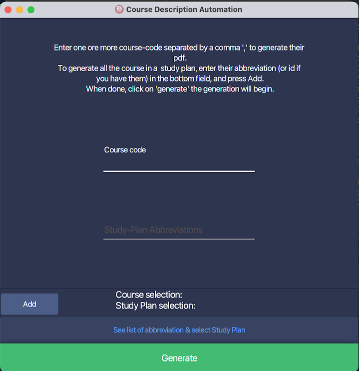
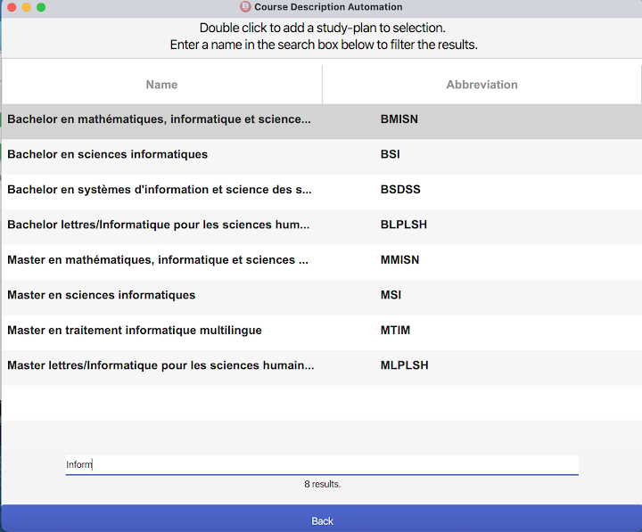
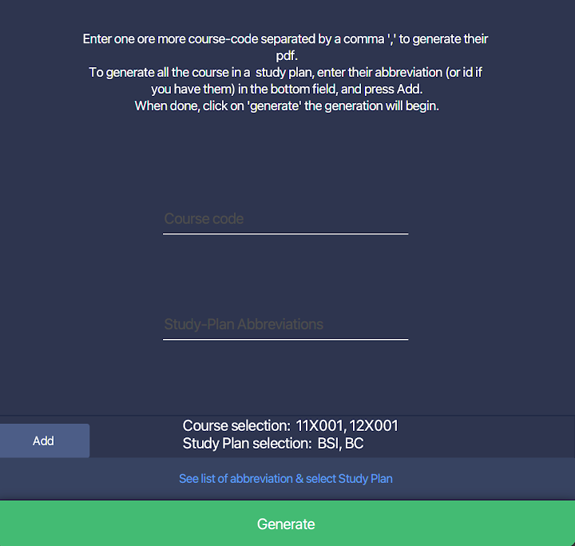

# Guide d'utilisation (Manuel FR)


<!-- vim-markdown-toc GFM -->

* [Installation](#installation)
    * [Dépendences](#dépendences)
    * [Installation](#installation-1)
* [Utilisation](#utilisation)
* [En cas d'erreur](#en-cas-derreur)
* [Structure du dossier du projet](#structure-du-dossier-du-projet)

<!-- vim-markdown-toc -->


## Installation

### Dépendences

Avant de lancer notre logiciel, il faut d'abord télécharger un programme nécessaire 
à son bon fonctionnement. Il s'appel 'wkhtmltopdf'. (Son utilité est assez explicite).

Pour ce faire il vous faut cliquer sur ce lien: [text](url) 
(cela va ouvrire votre navigateur et directement télécharger l'installeur.)

Une fois téléchargé double cliquez sur le fichier.

Si vous voyez un message d'erreur qui ressemble à 
 

Il vous faudra faire un clique droit sur le fichier, appuyer sur "ouvrir" puis "ouvrir quand même"  
(voir [https://support.apple.com/guide/mac-help/open-a-mac-app-from-an-unidentified-developer-mh40616/mac](https://support.apple.com/guide/mac-help/open-a-mac-app-from-an-unidentified-developer-mh40616/mac)  pour plus d'informations)

Vous devriez, désormais, pouvoir installer le programme normalement. (Suivez simplement les installations d'instructions)

### Installation

Maintenant décompresser le fichier .zip fourni dans votre dossier `documents`,
déplacez-vous-y.

Vous devriez voir les fichiers suivants:

```markdown
.
├── files/ (dossier)
├── Course-Description-Automation (programme)
├── pdfs/ (dossier)
└── LICENSE

```

double cliquez sur le fichier `Course-Description-Automation` pour le lancer.


***


## Utilisation


Comme vous pouvez le voir sur l'écran ci-dessous, il y a 2 moyens de générer des pdfs de cours.





1. Entrer le code des cours 1 par 1 séparé par une virgule dans le champs *"Course code"*.  
exemple: `11X001,11X002,11X006`  
Appuyer sur "**Add**" pour valider votre séléction, puis "**Generate**" pour lancer la génération.


2. Entrer des "abbréviations" de plans d'études pour générer chaque cours d'un plan d'études.  
Pour ce faire, ouvrez le menu de séléction en appuyant sur le bouton
"**See list of abbreviation & select study plan**", cela va ouvrir le menu suivant:  

    

    Vous pouvez maintenant simplement double cliquer sur le plan que vous voulez et cela va directement l'ajouter à la sélection. (vous pouvez double-cliquer n'importe où sur la ligne).  
Puis appuyer sur **Generate** quand vous avez fini (pas besoin d'appuyer sur "Add" si vous n'écrivez rien manuellement dans les champs.)

    Si vous voulez entrer les abbrévations  manuellement, cliquer 1 seule fois (au lieu de 2), cela va copier l'abbréviation du plan d'étude que vous pourrez coller ( avec `cmd (⌘)` + `v`) dans le champs *"Study-Plan Abbreviations"* de l'écran principal.
Une fois fait, appuyer sur le boutton "**Add**" pour valider votre séléction, puis "**generate**" pour lancer la génération.


    Une fois que votre séléction (de cour(s) et/ou plan(s) d'études) est validée, elle devrait ressembler à ça:

    

    appuyez sur Generate et c'est tout bon.

<br/>

Comme vous avez peut-être pu le remarquer sur la 2e image ci-dessus, vous pouvez chercher un plan d'études spécifique en entrant son nom dans la barre de recherche, pour filtrer les résultats.


Si le plan d'étude que vous recherchez n'est pas la liste, vous pouvez entrer manuellement l'identifiant de la base de donnée de l'unige qui correspond à ce plan d'étude.
(par exemple celui du bachelor en sciences informatique 2022 est `73710`).  
Entrez le comme si c'était une abbréviation dans le champs *"Study-Plan Abbreviations"*, appuyer sur "Add" puis "Generate".


***

## En cas d'erreur

Si jamais quelque chose ne fonctionne pas, que vous recevez un message d'erreur, ou que vous n'arrivez pas à installer le projet, n'hésitez pas à m'envoyer un mail à [noah.munz@etu.unige.ch](mailto:noah.munz@etu.unige.ch) .

Si pour une quelconque raison mon adresse unige n'est plus valide. J'ai inclus mon addresse personnelle dans la license ([munz.no@gmail.com](mailto:munz.no@gmail.com)).

Si votre erreur arrive *pendant* que vous utilisez le programme (i.e. vous arrivez à le démarrer sans problème).
Des rapports expliquant ce qui se passe quand et comment sont présents dans le dossier
`files/res/log`, joignez-les à votre mail pour que je puisse vous assister au mieux.

***

## Structure du dossier du projet

Si tout ce passe bien, vous ne devriez pas avoir besoin de ce que je vais vous dire dans cette section. 

J'ai parlé du dossier `log` dans la section précdente voici où le trouver:


```
├── files/
│   └── res/
│       ├── bin-converters/
|       |
│       └── log/ (ici)
|       .
│       .
|       .
|
├── Course-Description-Automation (executable)
├── pdfs 
└── LICENSE
```

Dans le dossier `files` puis `res`. 


Si jamais vous un problème et vous voulez vérifier qu'il ne vous manque aucun fichier pour lancer le programme (il n'y aucune raison particulière pouquoi cela arriverait mais on ne sait jamais.)  
Un schéma comme celui-dessus (mais complet) est présent à 
[structure-projet-github](https://github.com/David-Kyrat/Course-Description-Automation#end-packaged-structure)  
(sur ce schéma `[version]` correspond à une version de fichier e.g. `19.0.1` aucun fichier n'a réellement "version" dans son nom.)


***

<br/>

<br/>

**NB:** Une partie importante du projet a été l'optimisation de la vitesse de traitement du programme,
afin qu'il soit le plus rapide possible. Sur mon PC générer un plan d'étude entier est une affaires
d'une dizaine voir, éventuellement, vingtaine de secondes tout au plus. 

Cependant, ayant essayé sur un mac un peu plus vieux, la même génération prenait parfois plusieurs minutes... Donc si le programme à l'air de ne pas répondre / "freezer", la génération prend peut-être juste plus de temps que prévu.
